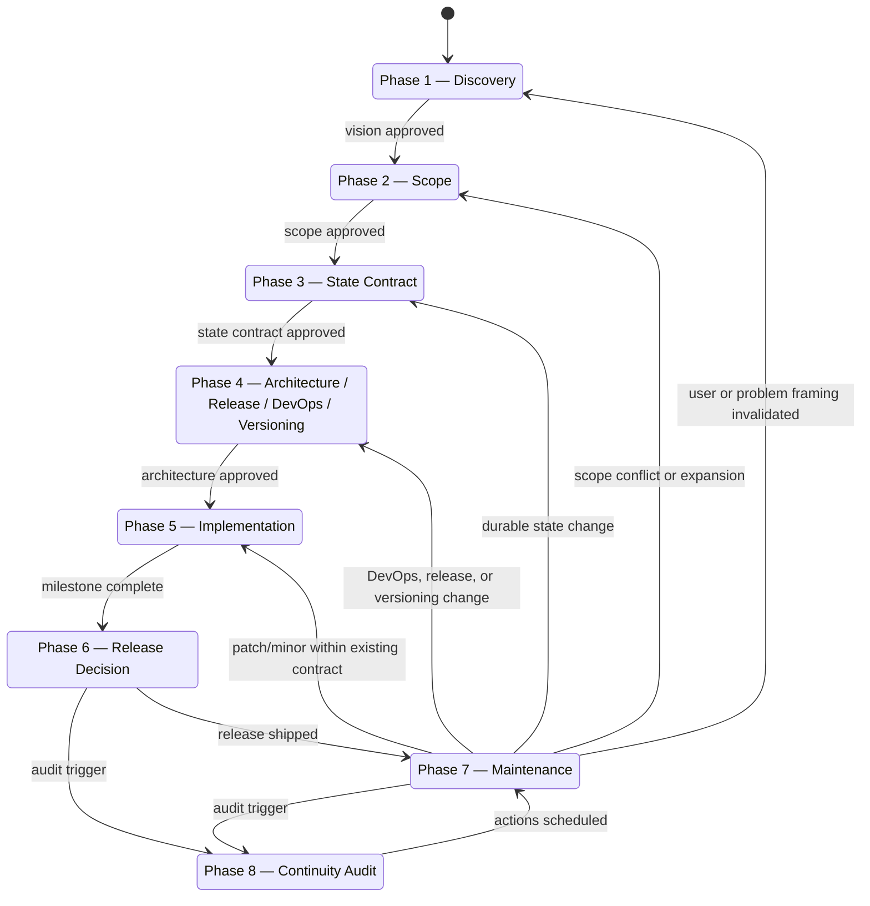
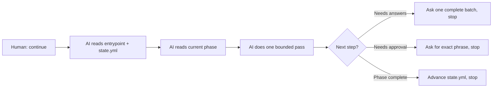

# PLSM — Product Lifecycle State Machine

> A framework that puts the critical product decisions where they belong — with the engineer, not the AI, not the codebase.

STATUS: draft

---

## What Is PLSM?

PLSM is a lifecycle state machine run by an LLM that walks you through the decisions that matter most — who the software is for, what it does, what data it owns, how it evolves — before implementation begins. The AI asks the questions. You own the answers. The AI then executes against what you decided.

This is the opposite of delegating to AI. PLSM demands your full attention as a software engineer precisely where it counts. What it gives back is an AI that executes with complete fidelity to decisions you actually made.

---

## The Authorship Problem

When the spec is vague, the AI fills in the gaps. When scope is fuzzy, the AI makes choices. When state decisions are deferred, the AI assumes. Each individual decision is small enough to let slide. Over time, the project drifts away from you — not dramatically, but decision by decision. You can describe what the code does. You cannot describe why it is the way it is. The decisions that shaped it live nowhere — not in your head, not in the docs, not anywhere a fresh pair of eyes could find them.

That is the authorship problem. You are producing code you do not fully own.

Faster implementation does not solve this. Better prompts do not solve this. The answer is a better build order — one that forces the critical decisions to happen before the AI writes a single line, and keeps them recorded and traceable as the project evolves.

---

## When PLSM Begins

Vibe coding is legitimate. Exploratory sessions to feel out what you are actually building have real value. PLSM is not a replacement for that.

PLSM begins when that exploration ends. The moment you think: *this is real, this needs to outlast me, I need to actually own this* — that is the moment PLSM exists for. It takes you from that commitment forward, through every phase of the product lifecycle, without letting the AI make the decisions that belong to you.

---

## Who This Is For

- **Solo developers** using AI coding tools who want to stop carrying the entire project in their head and start having real confidence before releasing v1.
- **Indie open source authors** who want their project to remain understandable and continuable even after a long break — or after they are gone.
- **Code authors** who want their project to remain understandable — to collaborators, to future maintainers, and to their own future self returning after months away.
- **Anyone inheriting or joining an existing codebase** who wants to quickly build a structured understanding of what the project is, what obligations it has made, and where the gaps are.

PLSM is designed for engineers who wear both hats — product thinking and technical execution. The decisions it forces require engineering depth to answer honestly.

---

## How It Works

PLSM organizes a project into three layers of files and nine lifecycle phases.

### The Three Layers

- **Control layer** — `entrypoint.md` + `state.yml`: tells a fresh AI where the project is and what to read next.
- **Protocol layer** — `execution/phase-*.md`: tells the AI how to behave in the current phase.
- **Result layer** — `state/phase-*.md`, `product/`, `maintainers/`: the current truth the project has settled on.

After phases 1–4, the result layer holds a complete written picture of the project before a single line of implementation is written: what problem it solves and for whom, what is and is not in scope, what data the system owns and how it may evolve, and how the project will be built, released, and maintained. That is what a fresh AI — or a new maintainer — reads to understand the project without reverse-engineering it from code.

### The File Structure

```
docs/
├── lifecycle/
│   ├── entrypoint.md          ← Start here. The AI reads this first, every time.
│   ├── state.yml              ← Current lifecycle position and runtime cursor.
│   ├── execution/             ← Phase-by-phase operational protocols (AI reads these).
│   ├── state/                 ← Current truth per phase (what has been decided).
│   └── humans/                ← Human-facing explanations. Start here if you are new.
├── product/                   ← Durable product knowledge (problem, scope).
├── maintainers/               ← Durable technical knowledge (state contract, architecture, etc).
└── todos.md                   ← Active implementation work map.
```

### Durable State

One concept underpins the entire framework: **durable state**. Durable state is any obligation the program has made to the outside world — anything that, if changed, would break or surprise something that depends on it. Database schema is one example, but the category is much wider: CLI argument shapes, config file formats, output file structures, behavioral patterns users have come to rely on.

A new CLI flag becomes an obligation the moment users build workflows around it. A schema change is not just a code change — it is a migration obligation. Phase 3 exists to make these obligations explicit before implementation begins. See [`docs/lifecycle/humans/08-durable-state.md`](docs/lifecycle/humans/08-durable-state.md) for the full treatment.

### The Lifecycle



Phases 1–4 are foundational. This is where you do the engineering thinking — the decisions the AI cannot make for you. Phase 5 is where the AI executes against what you decided. Phases 6–8 ensure that what ships is deliberate, and that what changes after shipping is handled with the right level of care.

Each phase answers one main question:

| Phase | Name | Main Question |
|-------|------|---------------|
| 0 | Onboarding *(existing projects only)* | What does this project already know, and what gaps remain? |
| 1 | Discovery | What are we really solving, and for whom? |
| 2 | Scope | What is the smallest durable thing worth building? |
| 3 | State Contract | What data exists, where does it live, and how may it evolve safely? |
| 4 | Architecture, Release, DevOps, Versioning | How does this project operate safely in practice? |
| 5 | Implementation | What is the next bounded implementation move? |
| 6 | Release Decision | Is this ready to become a real release candidate? |
| 7 | Maintenance | Does this change fit the current contract, or does it reopen earlier work? |
| 8 | Continuity Audit | Could someone else realistically inherit this project? |

### The One-Pass Loop

Every time you tell the AI to continue, it runs exactly one bounded pass:



The AI never silently advances a phase. It asks for an exact approval phrase. It never carries unresolved questions forward as hidden assumptions. A fresh AI with no prior context can resume a project in minutes — the state is in the files, not the conversation.

### After v1

The lifecycle does not end at release. After shipping, the project lives in Phase 7. Every change — a bug, a feature, a new insight — is classified there before any work begins. The classification determines how far back the project reopens, and it is never further back than necessary:

| Nature of the change | Reopens |
|---|---|
| Bug fix or patch — no observable behavior change | Stays in Phase 5 |
| DevOps, release workflow, or versioning change | Phase 4 |
| New or modified durable state, schema, or migration | Phase 3 |
| Scope expansion or conflict with non-goals | Phase 2 |
| User or problem framing no longer valid | Phase 1 |

A new CLI flag that breaks nothing today is still durable state — users will build workflows around it the moment it ships. Recording it at creation is what makes future changes safe.

When a phase reopens, the AI writes a short notice, marks downstream docs as invalid, and stops for your approval before continuing. The project does not silently drift forward with a broken foundation underneath it.

---

## Getting Started

### Starting a new project

1. Copy this `docs/` folder into your repository root.
2. Open a conversation with any capable LLM.
3. Use the starting prompt for your AI environment from [`docs/lifecycle/humans/07-working-with-ai.md`](docs/lifecycle/humans/07-working-with-ai.md).

The AI will read `state.yml`, find the project at Phase 1, and start asking the right discovery questions.

### Adopting PLSM on an existing project

1. Copy this `docs/` folder into your repository root.
2. Open a conversation with any capable LLM.
3. Use the starting prompt for your AI environment.

The AI will detect existing project files and suggest Phase 0 onboarding. Say `Initiate Phase 0 PLSM onboarding`. The AI reads the repository, presents its understanding of phases 1–4 for your review, incorporates your corrections, then writes pre-populated phase artifacts with gaps explicitly noted. You work through phases 1–4 normally, filling gaps rather than starting from scratch.

See [`docs/lifecycle/humans/10-adopting-plsm.md`](docs/lifecycle/humans/10-adopting-plsm.md) for the full walkthrough.

### Resuming an existing project

Start a new conversation with the same starting prompt for your environment. The AI reads `state.yml`, finds the current phase and state, and picks up exactly where you left off — no prior context required.

### Onboarding as a new maintainer

Start with the human-facing docs:

```
docs/lifecycle/humans/README.md
```

Then check `state.yml` to see where the project stands. The `docs/product/` and `docs/maintainers/` folders hold the settled decisions: what the project is, what it promised users, and what the current contracts are.

---

## The Hardest Part

PLSM has guardrails against AI drift, against implementation outpacing contracts, against maintenance changes quietly breaking earlier decisions. What it cannot guard against is the engineer arriving at Phase 3 with a scope that sounds tight but has a hidden ambiguity, or a user definition that feels clear but is actually two different users with conflicting needs.

Everything downstream — the state contract, the architecture, the implementation plan, every release decision — is built on what gets locked in phases 1 and 2. The execution protocols push the AI to ask precise questions, refuse vague answers, and keep tightening. None of that compensates for an engineer who does not yet fully understand their own product, or who is impatient to reach implementation, or who gives an answer that feels precise but is not.

The people most likely to rush phases 1 and 2 are the people who most need them. PLSM requires exactly the kind of honest, precise thinking that defines strong software engineering. That is not a limitation of the framework. It is the point.

If you find yourself wanting to skip ahead, that feeling is the signal to slow down.

---

## What PLSM Is Not

PLSM is not for every project. A small script, a throwaway experiment, or a prototype you will discard does not need this level of discipline.

It is also not the beginning — see [When PLSM Begins](#when-plsm-begins) above.

It does not replace engineering judgment. The AI cannot decide what product should exist, what tradeoffs matter, or what good architecture looks like for your context. That stays with you. PLSM ensures it stays with you explicitly, on record, and traceable.

---

## Further Reading

- [`docs/lifecycle/humans/README.md`](docs/lifecycle/humans/README.md) — Full human-facing map of the lifecycle: what each phase is for, how the AI and human work together, how recovery works.
- [`docs/lifecycle/humans/07-working-with-ai.md`](docs/lifecycle/humans/07-working-with-ai.md) — Starting prompts for each AI environment, phase 1–4 discipline, hardening techniques, and mid-conversation prompt patterns.

---

## License

MIT — PLSM's own lifecycle is versioned and maintained using itself.
