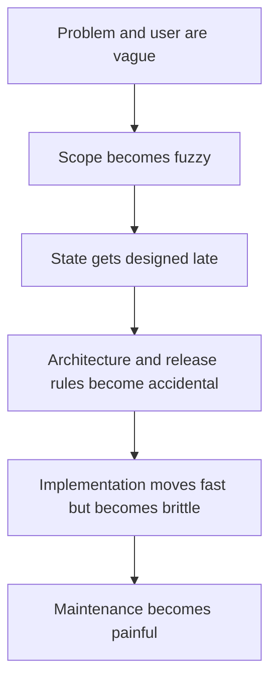
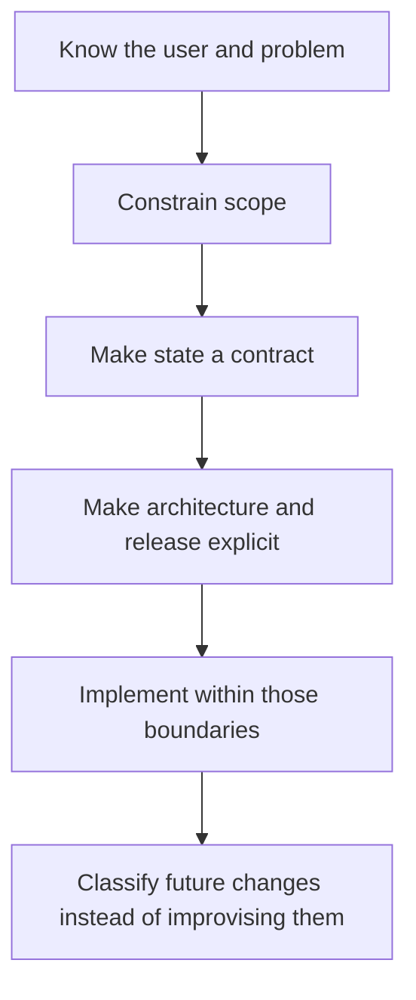
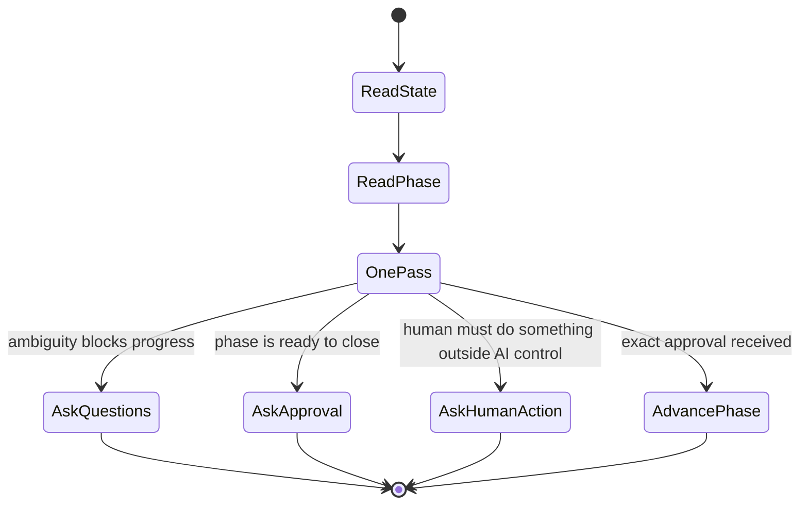

# docs/lifecycle/humans/01-big-picture.md — The Big Picture

## docs/lifecycle/humans/01-big-picture.md — What This Lifecycle Is

This lifecycle is **not** trying to be an autonomous product owner.

It is also **not** trying to be a generic “AI builds your app from a prompt” wrapper.

It is trying to do something narrower and more durable:

- help one human who is acting as both **product manager** and **software engineer**,
- move through the right software decisions in the right order,
- keep state, architecture, release, and maintenance decisions explicit,
- and keep the project understandable enough that it can outlast the original author.

## docs/lifecycle/humans/01-big-picture.md — Core Idea

The lifecycle treats software as something that should become gradually more durable.

For a **new project**:

1. first, understand **why it should exist**,
2. then narrow **what it should do**,
3. then define **how its durable state works**,
4. then define **how it will be built, released, and maintained**,
5. then implement it,
6. then evolve it carefully.

For an **existing project** adopting PLSM, Phase 0 comes first: the AI reads the codebase to understand what already exists before working through phases 1–4 to make those decisions explicit and fill any gaps.

## docs/lifecycle/humans/01-big-picture.md — Why The Order Matters

This lifecycle tries to reverse that failure pattern.

## docs/lifecycle/humans/01-big-picture.md — Simplicity Bias

The lifecycle is designed with a strong bias toward:

- simplicity over hidden convenience,
- composability over built-in magic,
- explicit boundaries over implied behavior,
- and durability over short-term speed.

That means the AI is expected to push back against complexity that makes the project harder to inherit.

## docs/lifecycle/humans/01-big-picture.md — The Human’s Role

The human owns:

- the problem,
- the target user,
- the scope,
- the tradeoffs,
- the approvals,
- and the final direction.

## docs/lifecycle/humans/01-big-picture.md — The AI’s Role

The AI owns:

- guiding the next step,
- asking the missing questions,
- writing and updating lifecycle artifacts,
- making phase boundaries explicit,
- checking consistency,
- stopping when approval or human action is required,
- and moving the lifecycle back when a contradiction is discovered.

## docs/lifecycle/humans/01-big-picture.md — The Practical Loop

