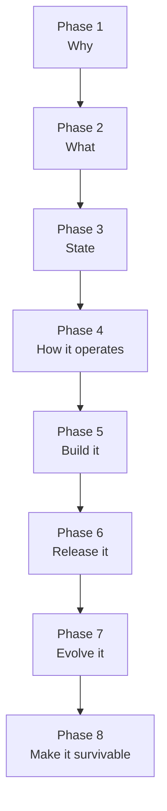
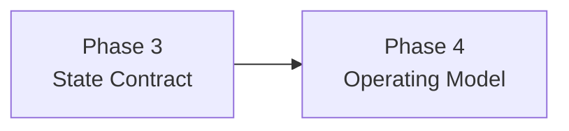

# docs/lifecycle/humans/02-phase-map.md — The Phase Map

## docs/lifecycle/humans/02-phase-map.md — Overview

There are 9 phases, numbered 0–8.

Phase 0 is optional — it is only entered when adopting PLSM on an existing project.

Most phases are compact and should fit in a relatively short working context.

Phase 5 is the exception because implementation can take many passes.

## docs/lifecycle/humans/02-phase-map.md — All Phases

```mermaid
flowchart LR
    P0[Phase 0 Onboarding] --> P1[Phase 1 Discovery]
    P1 --> P2[Phase 2 Scope]
    P2 --> P3[Phase 3 State Contract]
    P3 --> P4[Phase 4 Architecture]
    P4 --> P5[Phase 5 Implementation]
    P5 --> P6[Phase 6 Release Decision]
    P6 --> P7[Phase 7 Maintenance]
    P7 --> P8[Phase 8 Continuity]
    P8 --> P7
```

## docs/lifecycle/humans/02-phase-map.md — What Each Phase Is For

### Phase 0 — Onboarding (existing projects only)

Purpose:
- parse the existing repository across multiple passes,
- build an informed understanding of phases 1–4 from the codebase,
- confirm the big picture with the human,
- write pre-populated phase 1–4 artifacts with gaps explicitly noted.

Main question:
- **What does this project already know, and what gaps remain?**

### Phase 1 — Discovery

Purpose:
- identify the user,
- identify the problem,
- define why this should exist,
- define success.

Main question:
- **What are we really trying to solve, and for whom?**

### Phase 2 — Scope

Purpose:
- aggressively narrow the project,
- define in-scope, out-of-scope, and non-goals,
- reject seductive complexity.

Main question:
- **What is the smallest durable thing worth building?**

### Phase 3 — State Contract

Purpose:
- define durable state,
- define persistence boundaries,
- define write ownership,
- define migration assumptions.

Main question:
- **What data exists, where does it live, and how may it evolve safely?**

### Phase 4 — Architecture, Release Contract, DevOps, Versioning

Purpose:
- turn the earlier contracts into a buildable and maintainable operating model,
- define how releases happen,
- define what humans must still do,
- define patch/minor/major boundaries.

Main question:
- **How does this project operate safely in practice?**

### Phase 5 — Implementation

Purpose:
- build the system inside the earlier boundaries,
- manage ongoing work without letting implementation silently rewrite product or architectural truth.

Main question:
- **What is the next bounded implementation move?**

### Phase 6 — Release Decision

Purpose:
- decide whether what exists is release-worthy,
- classify the version correctly,
- check whether state or migration affects the release.

Main question:
- **Is this ready to become a real release candidate?**

### Phase 7 — Maintenance

Purpose:
- triage requests, bugs, and insights,
- decide whether they fit the current contract,
- reopen earlier phases when needed.

Main question:
- **Does this change belong inside the current contract, or does it reopen earlier work?**

### Phase 8 — Continuity

Purpose:
- make sure the project remains understandable and survivable,
- reduce hidden knowledge,
- improve handoff quality.

Main question:
- **Could someone else realistically inherit this project?**

## docs/lifecycle/humans/02-phase-map.md — The Key Structural Insight

The most important transition is often:

That is where “what the app is” meets “how the project can safely keep existing over time.”
