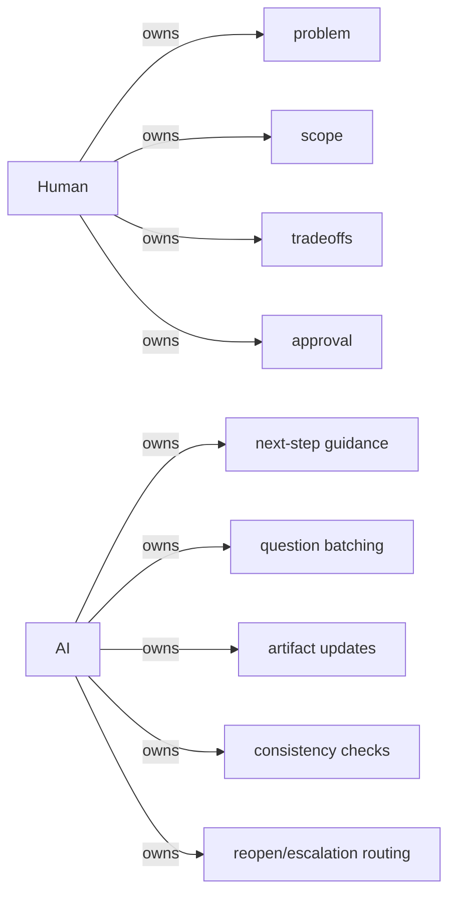
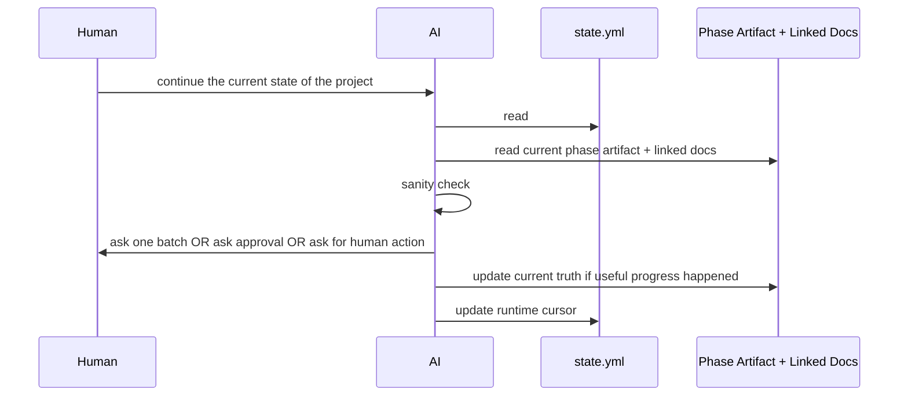
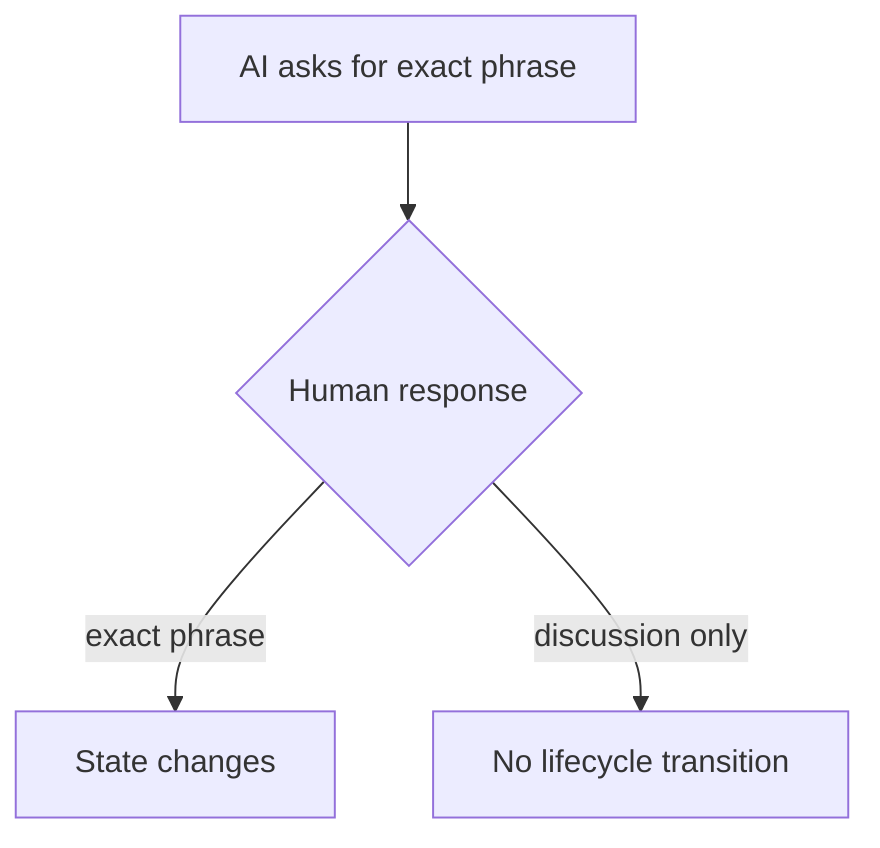

# docs/lifecycle/humans/03-how-ai-and-human-work-together.md — How The AI And Human Work Together

## docs/lifecycle/humans/03-how-ai-and-human-work-together.md — The Relationship

The lifecycle assumes one human is playing both:

- product owner,
- and lead engineer.

The AI is a disciplined guide and operator.

It should not silently make product decisions that belong to the human.

## docs/lifecycle/humans/03-how-ai-and-human-work-together.md — Decision Boundaries

## docs/lifecycle/humans/03-how-ai-and-human-work-together.md — What The AI Does In One Pass

## docs/lifecycle/humans/03-how-ai-and-human-work-together.md — The Three Main Ways A Pass Stops

### 1. The AI needs answers

The AI asks one complete batch of questions and stops.

### 2. The AI needs approval

The AI says exactly what phrase counts as approval, for example:

- `Approve Phase 4`

It does **not** guess approval from tone.

### 3. The human must do something outside AI control

Examples:
- merge a PR,
- configure a repo setting,
- create a secret,
- publish a release,
- verify an external environment change.

The AI must say:
- what to do,
- why,
- how it will check completion,
- and what evidence it will accept.

## docs/lifecycle/humans/03-how-ai-and-human-work-together.md — Lifecycle Commands

<!-- source of truth: docs/lifecycle/entrypoint.md -->

The human can explicitly control the lifecycle with commands. The authoritative list lives in `docs/lifecycle/entrypoint.md`. The commands are:

- `Initiate Phase 0 PLSM onboarding` — begins Phase 0 for an existing project.
- `Approve Phase 0 overview analysis` — approves the Phase 0 big picture and triggers artifact writing.
- `Approve Phase X` — approves the current phase and advances to the next.
- `Approve Phase 5 Plan` — confirms the initial implementation plan before coding begins.
- `Reopen Phase X` — reopens an earlier phase due to contradiction or change of intent.
- `Run Phase 8 audit` — triggers a continuity audit from any phase.

These are not casual phrases. They are treated as real lifecycle commands.

## docs/lifecycle/humans/03-how-ai-and-human-work-together.md — Why Exact Phrases Matter

The exact-phrase rule keeps the system simple:

- no guessing,
- no fuzzy approval,
- no accidental rewinds,
- no silent advancement.

