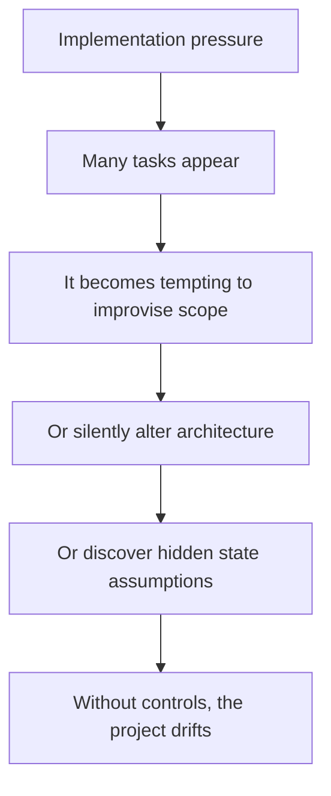
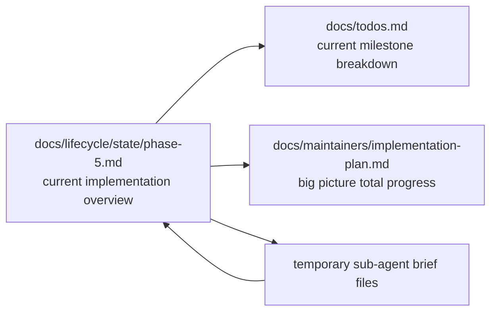
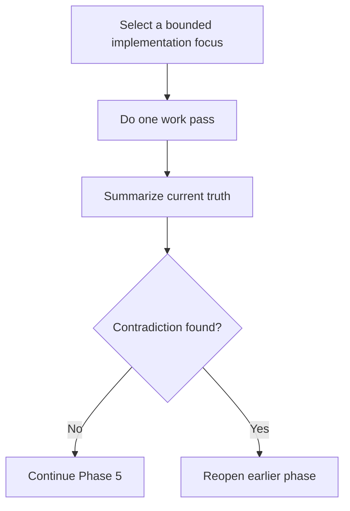

# docs/lifecycle/humans/04-why-phase-5-is-special.md — Why Phase 5 Is Special

## docs/lifecycle/humans/04-why-phase-5-is-special.md — The Short Version

Phases 1–4 and 6–8 are mostly about **making and checking durable decisions**.

Phase 5 is about **doing a lot of bounded work without letting the work rewrite the earlier truth**.

That is why Phase 5 gets extra structure.

## docs/lifecycle/humans/04-why-phase-5-is-special.md — Why It Needs Extra Care

Phase 5 exists to prevent that drift.

## docs/lifecycle/humans/04-why-phase-5-is-special.md — The Parent AI’s Job

The parent AI should:

- keep the implementation focus narrow,
- summarize what is done,
- summarize what still needs attention,
- know what not to worry about,
- create small bounded sub-agent briefs when needed,
- and reopen earlier phases if implementation reveals a contradiction.

## docs/lifecycle/humans/04-why-phase-5-is-special.md — The Key Files

`implementation-plan.md` holds the big picture — how phases 3 and 4 translate into buildable components and the overall milestone structure. `todos.md` holds the current breakdown of the active milestone. Both are updated as work progresses, but at different timescales — `implementation-plan.md` changes when milestones shift; `todos.md` changes every pass.

## docs/lifecycle/humans/04-why-phase-5-is-special.md — Simplicity Guardrails

Phase 5 should stay simple by following these rules:

- no more than **3 active workstreams** unless the human explicitly approves more,
- unresolved implementation concerns must stay visible,
- sub-agents do **not** own lifecycle state,
- sub-agents do **not** edit phase artifacts,
- if implementation contradicts earlier decisions, stop and reopen the right phase.

## docs/lifecycle/humans/04-why-phase-5-is-special.md — The Healthy Pattern

