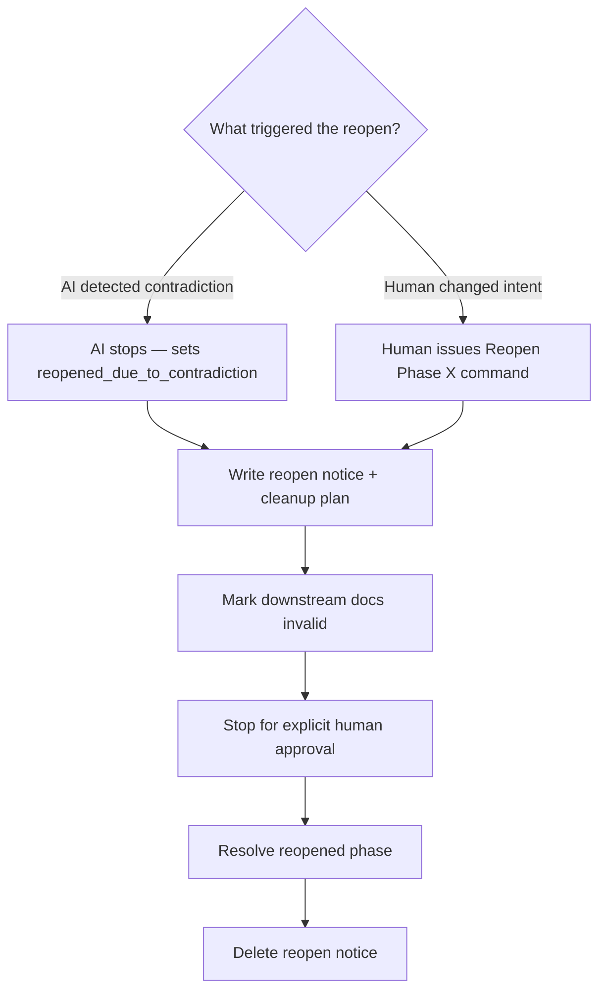
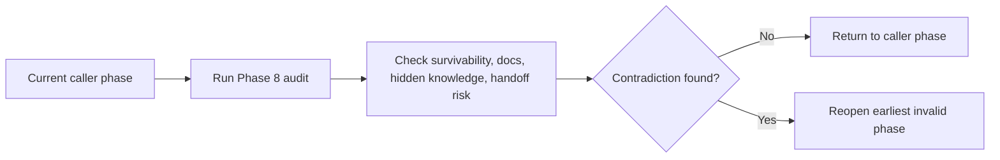

# docs/lifecycle/humans/05-reopen-audit-and-recovery.md — Reopen, Audit, And Recovery

## docs/lifecycle/humans/05-reopen-audit-and-recovery.md — Why Reopening Exists

A later phase can reveal that an earlier phase was incomplete or wrong.

When that happens, the lifecycle should **move backward cleanly**, not pretend the problem can be patched over in place.

## docs/lifecycle/humans/05-reopen-audit-and-recovery.md — Two Kinds Of Reopen

Reopens happen in two different ways, for two different reasons.

### AI-triggered: contradiction detected

The AI triggers a reopen automatically when it detects a *logical contradiction* — something that makes an earlier decision demonstrably broken or impossible to satisfy.

Examples:
- Phase 4 architecture requires a type of durable state that Phase 3 explicitly excluded.
- Phase 5 implementation reveals the state contract has a field that is simultaneously required and nullable in different parts of the spec.
- Phase 8 audit finds that the docs describe a behavior the code does not implement.

In these cases the AI cannot continue without compounding the inconsistency. It sets `current_state: reopened_due_to_contradiction`, writes the reopen notice, marks affected downstream docs invalid, and stops. It does not ask whether to reopen — the contradiction requires it.

### Human-triggered: change of intent

The human triggers a reopen when they *decide* to change direction, even if no logical contradiction exists.

Examples:
- You realize after Phase 3 that the state contract does not reflect what you actually want.
- You want to revisit scope after implementation has started.
- You change your mind about a product decision that was previously approved.

The AI cannot detect a change of intent — only the human knows when that has happened. Use:

- `Reopen Phase 1`
- `Reopen Phase 2`
- `Reopen Phase 3`
- `Reopen Phase 4`

## docs/lifecycle/humans/05-reopen-audit-and-recovery.md — What A Reopen Notice Should Do

A reopen notice should be short. It should only say:

- what was discovered,
- why later work is now risky or invalid,
- which downstream docs are invalid,
- and what cleanup is needed before continuing.

It is a correction tool, not a historical narrative.

## docs/lifecycle/humans/05-reopen-audit-and-recovery.md — Phase 8 Audit

Phase 8 can be entered normally, but it can also be called directly.

Use:

- `Run Phase 8 audit`

when the goal is to check survivability and handoff quality without pretending the whole lifecycle has naturally progressed there.

## docs/lifecycle/humans/05-reopen-audit-and-recovery.md — Callable Audit Flow

## docs/lifecycle/humans/05-reopen-audit-and-recovery.md — Corruption Is Different

Reopen means:
- the lifecycle still makes sense,
- but an earlier decision must be revisited.

Corruption means:
- the lifecycle runtime itself is broken,
- for example missing artifacts, missing execution docs, or invalid state routing.

When corruption happens, normal execution stops immediately.
