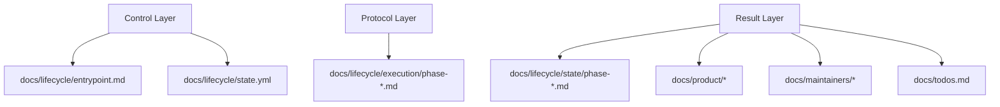
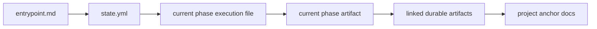

# docs/lifecycle/humans/06-files-that-matter.md — The Files That Matter

## docs/lifecycle/humans/06-files-that-matter.md — The Three Layers

## docs/lifecycle/humans/06-files-that-matter.md — What Each Layer Means

### Control layer

This tells a fresh AI:
- where the project is,
- why it stopped,
- what to read next.

### Protocol layer

This tells the AI:
- how to behave in the current phase,
- what questions to ask,
- what outputs to write,
- what approval phrase to request,
- and where to stop.

### Result layer

This is the current truth the project has already settled on.

## docs/lifecycle/humans/06-files-that-matter.md — The Runtime Read Order

## docs/lifecycle/humans/06-files-that-matter.md — A Helpful Intuition

If you are a human reader:

- `docs/lifecycle/humans/*` explains the system,
- `docs/lifecycle/state.yml` tells you where the system currently is,
- `docs/lifecycle/state/phase-*.md` tells you what the current phase believes,
- `docs/product/*` and `docs/maintainers/*` hold the durable project knowledge.

## docs/lifecycle/humans/06-files-that-matter.md — Phase 0 Scrap Paper

During Phase 0 onboarding, a transient layer exists outside the three-layer model:

- `docs/lifecycle/scrap-paper.md` and `docs/lifecycle/scrap-paper-*.md`

These are working memory only. They accumulate parsing findings and the in-progress overview draft. They do not persist after Phase 0 completes — they are deleted once `Approve Phase 0 overview analysis` is given and the phase 1–4 artifacts are written. They are never referenced by any other lifecycle file.

## docs/lifecycle/humans/06-files-that-matter.md — What Not To Read First

For a first-time human reader, do **not** start with:

- `docs/lifecycle/execution/*`

Those are runnable operational files.

Start with this humans folder first, then look at `state.yml`, then only read the current phase execution file if you need to understand how the AI will behave next.
