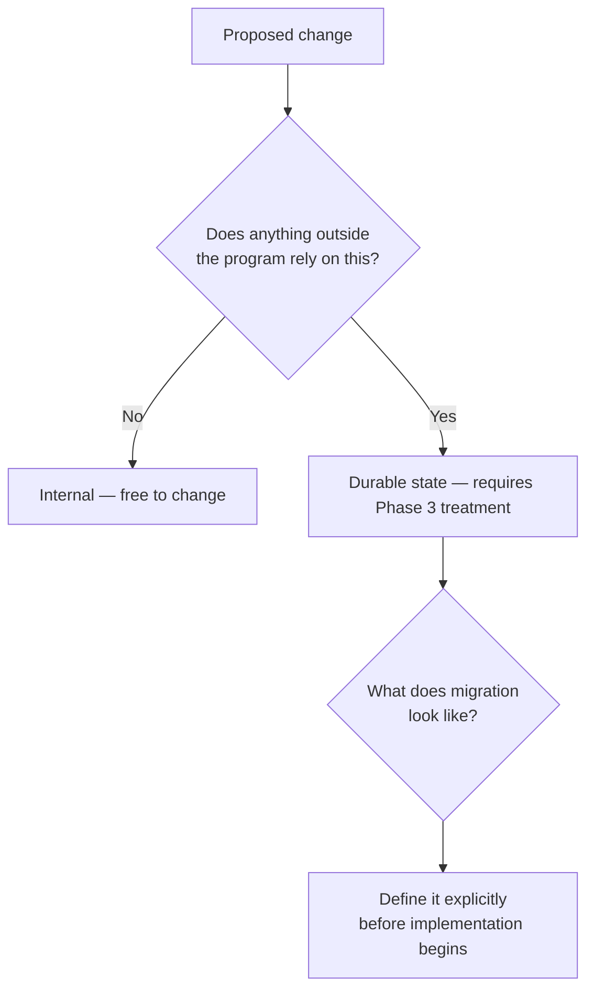
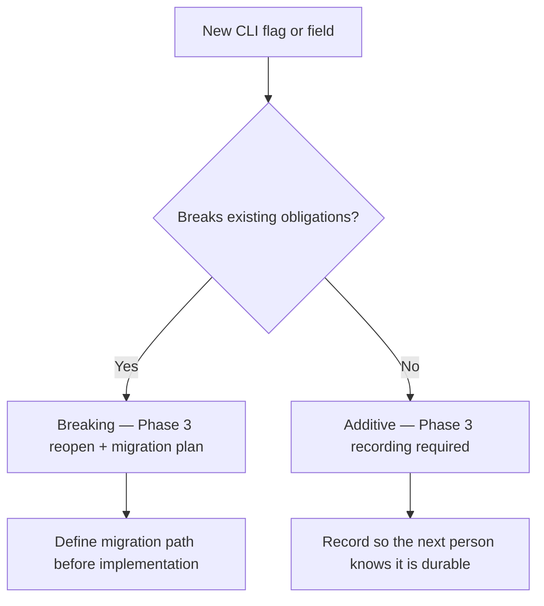

# docs/lifecycle/humans/08-durable-state.md — What Is Durable State

## docs/lifecycle/humans/08-durable-state.md — The Core Idea

Durable state is any obligation the program has made to the outside world.

The key word is *obligation*. If you change something and nothing outside the program is surprised or broken, it was not durable state. If you change something and a user's saved data becomes unreadable, a script that called your CLI stops working, or a config file from the previous version is silently misread — that was durable state.

The program does not get to unilaterally revise an obligation. It has to honor it, migrate it, or explicitly break it with a major version bump.

---

## docs/lifecycle/humans/08-durable-state.md — It Is Much Wider Than A Database

Most developers think of durable state as database schema. Schema is one instance. The category includes anything a dependent relies on continuing to work:

**Persistence:**
- Database schema — tables, columns, types, constraints
- File formats written to disk — JSON structure, binary layout, field names
- Saved configuration — keys, value shapes, defaults

**Interfaces:**
- CLI argument names, shapes, and behavior
- Environment variable names and expected values
- API shapes — request fields, response structures, status codes
- Plugin or extension contracts

**Behavioral expectations:**
- Output that other tools parse or pipe into
- Ordering or formatting that downstream consumers depend on
- Side effects users have come to rely on — what files get created, where, in what format

**Implicit contracts:**
- A feature that has always worked a certain way, even if it was never formally documented
- A default that users have built workflows around

---

## docs/lifecycle/humans/08-durable-state.md — The Migration Obligation

Every piece of durable state carries a migration obligation.

When v1 writes a database with a certain schema, v2 must either read that schema unchanged, migrate it forward safely, or tell users explicitly that their v1 data is not compatible.

The same is true for CLI arguments. If v1 accepts `--output-dir`, a v2 that silently renames it to `--out` has broken every script, alias, and workflow that called the program. That is a durable state change. It belongs in Phase 3, not as a casual rename in Phase 5.

---

## docs/lifecycle/humans/08-durable-state.md — Why Phase 3 Exists

Phase 3 forces you to make durable state explicit before any code is written.

This matters because durable state decisions made implicitly during implementation are the hardest kind to fix later. Once a database column exists in production, once a CLI flag is documented, once users have built workflows around a behavior — the obligation is real whether you named it or not.

Phase 3 asks:
- What data does this system own?
- Where does it live?
- Who may write to it?
- What invariants must stay true across versions?
- What migration assumptions are we making?

Answering these before implementation means every later decision — architecture, release contract, versioning boundaries — can be made against something stable.

---

## docs/lifecycle/humans/08-durable-state.md — Durable State And The Post-V1 Lifecycle

After release, every incoming change passes through Phase 7 — Maintenance. One of Phase 7's first questions is always: *does this touch durable state?*

If it does, the project reopens Phase 3 before anything is implemented. Not because Phase 3 is bureaucratic overhead, but because a change to durable state without explicit migration planning is how projects quietly break their users.

A change that adds a new optional CLI flag with no effect on existing usage is a durable state change — but a small, safe one. A change that renames a required field in a config file is a durable state change that may require a migration path, a deprecation notice, or a major version bump.

Phase 7 classifies which kind it is. Phase 3 handles it properly.

---

## docs/lifecycle/humans/08-durable-state.md — User Docs: Contract Or Implementation?

User-facing documentation — a README usage section, a website, CLI help text, a man page — describes durable state. But it can play one of two roles, and they must not be confused.

**The docs are the contract** when they define what the system should do and the code is expected to match them. In this case the docs are authoritative. The state contract links to them rather than duplicating their content. When the contract changes, the docs change first and the code follows.

**The docs are implementation** when the code defines what the system actually does and the docs are generated or written to reflect it. In this case the state contract is authoritative. The docs are a downstream artifact — derived from the contract, expected to drift if the contract changes, and not a source of truth themselves.

**The test:** if the docs and the code disagree on something — say the README describes a flag as `--output-dir` but the code uses `--out` — which one is wrong? Whichever answer feels obviously correct tells you which is the contract.

The most important rule: there must be exactly one source of truth for each piece of durable state. User docs and the state contract must never both claim to be authoritative for the same thing. Duplication between them means two things must be kept in sync, which means one of them will eventually go stale.

---

## docs/lifecycle/humans/08-durable-state.md — Additive Vs Breaking

Not all durable state changes break existing obligations. Some create new ones.

A new CLI flag that does not change any existing behavior is **additive** — nothing currently relying on the program is surprised. It is still durable state. The moment it ships, users will build workflows around it. If it is ever renamed, removed, or changed later, those users are broken.

The obligation starts at creation, not at modification.

This means new durable state must be recorded in Phase 3 at the time it is added — not because it breaks anything now, but because the person who touches it next needs to know the obligation exists. A flag that was never recorded looks like internal implementation detail. It gets renamed in a refactor. Users are silently broken. Nobody noticed it was durable.

Whether something qualifies as durable state requires human judgment. The two-question test below is the guide — not a mechanical checklist.

---

## docs/lifecycle/humans/08-durable-state.md — A Useful Test

When evaluating whether something is durable state, ask two questions:

> *If I change this without telling anyone, who would be surprised?*

If someone outside the codebase would be surprised — a user, a script, a plugin, another program, saved data — it is durable state.

> *If I ship this, who will form expectations around it?*

Even if nothing is broken today, anything user-facing that ships becomes an obligation the moment users encounter it. Record it in Phase 3 now, or the next person to touch it will not know it is durable.
