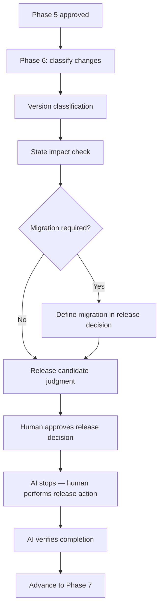
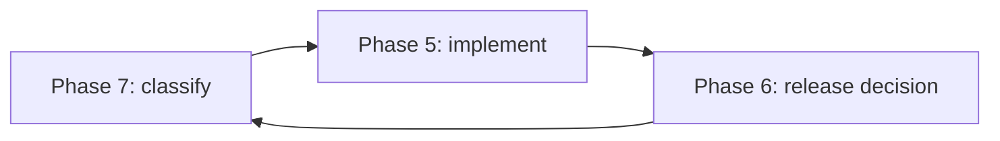
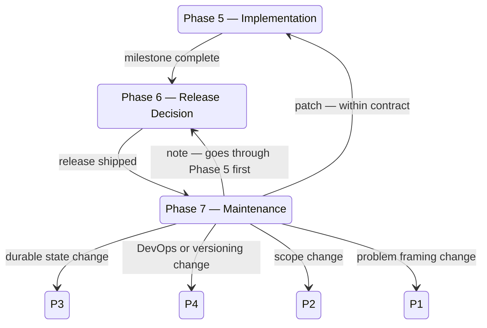

# docs/lifecycle/humans/09-phase-6-and-7.md — Phase 6 And Phase 7

## docs/lifecycle/humans/09-phase-6-and-7.md — The Key Distinction

Phases 1–5 each happen once per lifecycle pass and complete. Phase 6 and Phase 7 are different.

**Phase 6** is a one-time gate that separates "implementation is done" from "software is shipped." It happens after every Phase 5 milestone before a release goes out.

**Phase 7** is a standing phase. It does not complete — it loops. Once you are in Phase 7, you stay there. Every future change, bug, or request enters the project through Phase 7 first.

---

## docs/lifecycle/humans/09-phase-6-and-7.md — Phase 6: Release Decision

### Why it exists

Phase 5 completing only means a milestone is finished. It does not automatically mean the project is ready to ship. Phase 6 exists to answer that question explicitly before anything is released.

### What happens

Phase 6 takes stock of everything changed since the last release, classifies the version (patch, minor, or major against the versioning boundaries defined in Phase 4), checks whether durable state was touched and whether migration is required, and produces a release candidate judgment.

For a first release, the change set is the entire implementation. For subsequent releases, it is everything since the previous release tag.

### The human action gate

Phase 6 has a hard stop that no other phase has in quite the same way: the AI cannot perform the actual release. Tagging a version, merging a PR, publishing a package — these are human actions. The AI names the exact action required, references the relevant entry in `docs/maintainers/human-actions.md`, states how it will verify completion, and waits. The project does not advance to Phase 7 until the release action is done and verifiable.

### What approving Phase 6 means

`Approve Phase 6` means you accept two things: the version classification, and the release candidate judgment. Both must be coherent before you give that phrase.

---

## docs/lifecycle/humans/09-phase-6-and-7.md — Phase 7: Maintenance

### Why it exists

After release, the project has real users with real expectations. Changes can no longer be made casually. Phase 7 is the standing gate that every future change passes through before work begins. Its only job is classification — determining what kind of change this is and what that means for the contracts already in place.

### How signals enter

Phase 7 is conversational. The human describes a change, bug, or improvement in chat. The AI restates it to confirm understanding, asks clarifying questions if needed, then classifies it. If the human wants to point to an external doc — a GitHub issue, a bug report, a feature spec — the AI reads it as context. There is no formal intake form.

### The post-release loop

This loop repeats for the life of the project. Phase 7 never ends — it is the home the project returns to after every release.

### Classification before everything

Nothing is implemented until Phase 7 has classified it. Classification uses the versioning boundaries defined in Phase 4 as its guide:

| Classification | What it means | Where it goes |
|---|---|---|
| Patch | No durable state change, no observable behavior change | Phase 5 directly |
| Minor | Additive durable state — new obligations, nothing existing broken | Phase 3 first to record the new obligation, then Phase 5 |
| Major | Existing durable state obligation changed or removed | Phase 3 with migration plan required before Phase 5 |
| DevOps, release, or versioning change | Release or operational assumptions invalidated | Phase 4 |
| Scope expansion | Conflicts with or expands non-goals | Phase 2 |
| Problem or user framing invalid | Core assumptions about the user or problem no longer hold | Phase 1 |

The reason minor changes go through Phase 3 even when nothing is broken: the moment a new CLI flag or config field ships, users will build workflows around it. If it is never recorded in the state contract, the next person to touch it will not know the obligation exists.

### Valid commands in Phase 7

From Phase 7, the following are valid:

- `Reopen Phase 1` through `Reopen Phase 4` — based on the classification above.
- `Run Phase 8 audit` — callable at any time to check whether docs, lifecycle state, and reality still agree.
- `Approve Phase 7` — only for an explicit maintenance snapshot before a major handoff, not for routine maintenance.

The following are not valid from Phase 7:
- `Reopen Phase 5`, `Reopen Phase 6`, `Reopen Phase 7`, `Reopen Phase 8` — Phase 5 is a destination, Phase 6 follows Phase 5, you are already in Phase 7, and Phase 8 is callable not reopenable.

### What Phase 7 does not do

Phase 7 does not implement anything. It does not approve implementations. It classifies, routes, and returns. The implementation happens in Phase 5. The release decision happens in Phase 6. Phase 7 is the triage gate between them.

---

## docs/lifecycle/humans/09-phase-6-and-7.md — How They Work Together

The key insight is that Phase 6 is a quality and release mechanics gate, and Phase 7 is a classification gate. Neither does implementation work. Together they ensure that what gets shipped is deliberate, and that what gets changed after shipping is handled with the right level of care.
