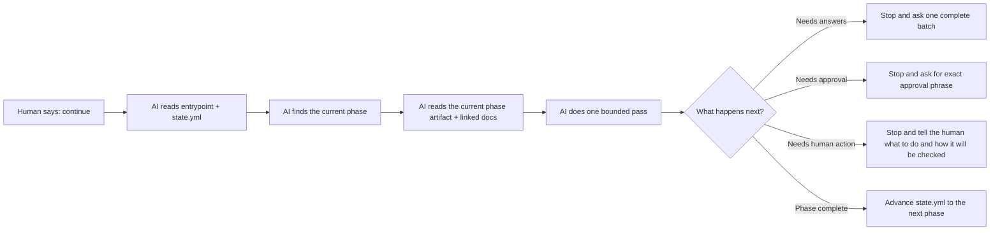

# docs/lifecycle/humans/README.md — Start Here

This folder is the **human-facing map** of the lifecycle.

It is for a first-time reader who wants to quickly understand:

- what this lifecycle is trying to do,
- how the phases fit together,
- why the AI keeps stopping for approvals or questions,
- why Phase 5 is different,
- and how the system recovers when something earlier turns out to be wrong.

This folder is intentionally **conceptual**. It is not the runnable protocol.

If you are starting a **new project**, read these in order:

1. `docs/lifecycle/humans/01-big-picture.md`
2. `docs/lifecycle/humans/02-phase-map.md`
3. `docs/lifecycle/humans/03-how-ai-and-human-work-together.md`

If you are **adopting PLSM on an existing project**, start here first:

1. `docs/lifecycle/humans/10-adopting-plsm.md`
2. `docs/lifecycle/humans/02-phase-map.md`
3. `docs/lifecycle/humans/03-how-ai-and-human-work-together.md`

If you want the rest:

- `docs/lifecycle/humans/04-why-phase-5-is-special.md`
- `docs/lifecycle/humans/05-reopen-audit-and-recovery.md`
- `docs/lifecycle/humans/06-files-that-matter.md`

Reference and concepts:

- `docs/lifecycle/humans/07-working-with-ai.md` — starting prompts for each AI environment, phase 1–4 discipline, and mid-conversation patterns.
- `docs/lifecycle/humans/08-durable-state.md` — what durable state is, why it is wider than a database, and the difference between additive and breaking changes.
- `docs/lifecycle/humans/09-phase-6-and-7.md` — how Phase 6 and Phase 7 work, why Phase 7 is a standing loop rather than a one-time phase, and what commands are valid from each.
- `docs/lifecycle/humans/10-adopting-plsm.md` — how to bring PLSM into an existing project using Phase 0 onboarding.

## docs/lifecycle/humans/README.md — One-Sentence Mental Model

This lifecycle is a **human-in-the-loop operating system for building software that should outlast its original author**.

The AI helps the human move through the right questions, decisions, approvals, and checks in the right order.

## docs/lifecycle/humans/README.md — At A Glance

